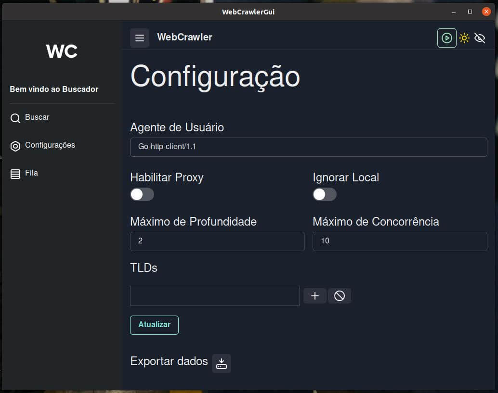

## Web Crawler com Interface Gráfica

Este projeto implementa um web crawler com interface gráfica que permite coletar, consultar e exportar informações de websites.
Ele foi baseado no projeto [WebCrawler](https://github.com/gabrielmoura/webCrawler) e adiciona recursos como interface gráfica, filtros de busca, configurações avançadas e armazenamento em banco de dados.

### Motivação

- Você é proprietário do seu próprio conteúdo e buscas.
- Sem rastreamento.
- Sem que terceiros tenham acesso às suas buscas.
- Auditável.
- Interface simples.
- Pode ser usado com Tor e I2P.

### Funcionalidades Principais

* **Pausar e Continuar Coleta:** Controle o processo de coleta de dados.
* **Consultar Informações:** Visualize e busque dados coletados.
* **Exportar Dados:** Salve informações em formato JSON.
* **Importar Dados:** Carregue informações de um arquivo JSON.
* **Armazenamento em Banco de Dados:** Utilize BadgerDB para persistência de dados.
* **Filtros de Busca:**
  * **Profundidade:** Defina o nível máximo de profundidade na busca.
  * **TLDs Permitidos:** Limite a busca por domínios de alto nível específicos.
* **Configurações Avançadas:**
  * **UserAgent:** Personalize o agente de usuário.
  * **Proxy:** Utilize um servidor proxy.
  * **Limite de Profundidade:** Controle a profundidade máxima da busca.

### Tecnologias Utilizadas

* **Backend:**
  * Golang
  * BadgerDB
  * Protobuf (serialização de dados)
* **Frontend:**
  * Wails (integração Go/Web)
  * React
  * TypeScript
  * Chakra UI
  * JSON (comunicação com backend)
* **Configuração:**
  * YAML

### Como Funciona

O projeto é dividido em backend (responsável pela coleta e armazenamento) e frontend (interface gráfica).

**Backend**

1. Entra em loop aguardando permissão para iniciar a busca.
2. Ao ser habilitado, acessa o próximo site da fila, extrai título, descrição, conteúdo e links.
3. Converte os dados para Protobuf e salva no banco de dados.
4. Adiciona os novos links à fila, incrementando sua profundidade.
5. Para a coleta de um link específico ao atingir o limite de profundidade.
6. A cada 5 minutos, pausa a escrita para consolidar o banco de dados.

**Frontend**

* Apresenta os dados coletados de forma organizada.
* Permite interação com o backend (iniciar/pausar coleta, filtros, etc.).

### Requisitos

* **Windows:** WebView2
* **Linux:** libwebkit

### Capturas de Tela

* Tela de Busca: 
* Tela de Resultados: 
* Tela de Configuração: 
* Tela de Processamento: 

### Instalação e Uso
1. **Clone o repositório:** `git clone https://github.com/gabrielmoura/webCrawlerGui`
2. **Siga as instruções:** Siga as instruções no arquivo `INSTALL.md`.

**Contribuições são bem-vindas!** Sinta-se à vontade para abrir issues e pull requests.

